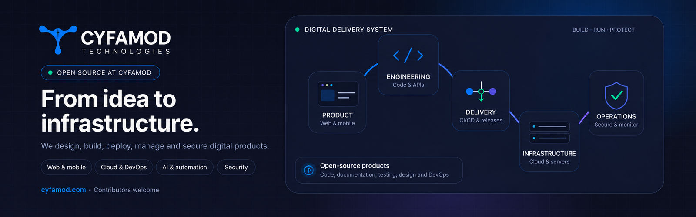

<picture>
  
</picture>

<div align="center">

### Building useful digital products—and the reliable systems behind them.

[](https://cyfamod.com)
[](https://github.com/search?q=org%3ACyfamod-Technologies+is%3Aissue+is%3Aopen&type=issues)
[](https://github.com/Cyfamod-Technologies/.github/blob/main/CONTRIBUTING.md)
[](mailto:info@cyfamod.com?subject=Project%20enquiry%20from%20GitHub)

</div>

---

## About Cyfamod Technologies

Cyfamod Technologies is a technology company that designs, builds and operates complete digital systems. We work across the product lifecycle—from discovery and user experience to application engineering, deployment, cloud infrastructure, server management, security, monitoring and ongoing support.

Our public GitHub organization is where we share selected products, reusable engineering work and opportunities for developers, designers, technical writers, testers, security practitioners and DevOps engineers to contribute.

<table>
<tr>
<td width="50%" valign="top">

### 🧑🏽‍💻 Build with us

Contribute to products that solve practical problems.

- Browse [open issues](https://github.com/search?q=org%3ACyfamod-Technologies+is%3Aissue+is%3Aopen&type=issues)
- Find [good first issues](https://github.com/search?q=org%3ACyfamod-Technologies+label%3A%22good+first+issue%22+is%3Aissue+is%3Aopen&type=issues)
- Read our [contribution guide](https://github.com/Cyfamod-Technologies/.github/blob/main/CONTRIBUTING.md)
- Improve code, docs, tests, UX, security or infrastructure

</td>
<td width="50%" valign="top">

### 🤝 Work with Cyfamod

Need a product built or an existing platform improved?

- Web and mobile applications
- Cloud and server management
- DevOps and deployment automation
- AI-powered workflows and integrations
- Cybersecurity, monitoring and support

[Visit our website](https://cyfamod.com) · [Email our team](mailto:info@cyfamod.com?subject=Project%20enquiry%20from%20GitHub)

</td>
</tr>
</table>

---

## Featured open-source projects

| Project | What it does | Primary stack |
|---|---|---|
| [**school-fe-nextjs**](https://github.com/Cyfamod-Technologies/school-fe-nextjs) | Role-based web experience for administrators, teachers, students and parents in the Cyfamod School Management System. | Next.js · React · TypeScript |
| [**school-be-laravel**](https://github.com/Cyfamod-Technologies/school-be-laravel) | Multi-tenant API and business logic powering school operations, access control, portals, billing and analytics. | Laravel · PHP · SQL |
| [**school-public-web**](https://github.com/Cyfamod-Technologies/school-public-web) | Public-facing school websites with custom-domain support and configurable themes. | Next.js · TypeScript |

[Explore all repositories →](https://github.com/orgs/Cyfamod-Technologies/repositories)

---

## What we build and operate

| Product engineering | Cloud and operations | Intelligence and protection |
|---|---|---|
| Websites and web applications | Cloud architecture and migration | AI-powered automation |
| Mobile and cross-platform apps | Server and container management | Business analytics |
| APIs, integrations and dashboards | CI/CD and release engineering | Cybersecurity and hardening |
| UI/UX implementation | Monitoring, reliability and support | Identity, access and data protection |

---

## Ways to contribute

A valuable contribution is not limited to writing application code.

- **Engineering:** frontend, backend, mobile, APIs and integrations
- **Documentation:** setup guides, architecture notes and examples
- **Quality:** testing, accessibility reviews and bug reproduction
- **Design:** UX flows, UI improvements and design-system work
- **Platform:** Docker, CI/CD, cloud, observability and developer experience
- **Security:** safe vulnerability reporting and defensive improvements

Before starting, read [CONTRIBUTING.md](https://github.com/Cyfamod-Technologies/.github/blob/main/CONTRIBUTING.md) and check whether the target repository has additional local instructions.

---

## Contribution workflow

```text
Choose an issue → Discuss the approach → Fork and branch → Build and test → Open a focused pull request
```

We aim to review well-scoped contributions respectfully and provide clear feedback. For security concerns, please follow our [security policy](https://github.com/Cyfamod-Technologies/.github/blob/main/SECURITY.md) instead of opening a public issue.

---

<div align="center">

### Let us build something useful together.

[**Explore repositories**](https://github.com/orgs/Cyfamod-Technologies/repositories) · [**Contribute**](https://github.com/Cyfamod-Technologies/.github/blob/main/CONTRIBUTING.md) · [**Start a project**](mailto:info@cyfamod.com?subject=Project%20enquiry%20from%20GitHub) · [**cyfamod.com**](https://cyfamod.com)

<sub>Cyfamod Technologies · Innovating Tomorrow, Today.</sub>

</div>
